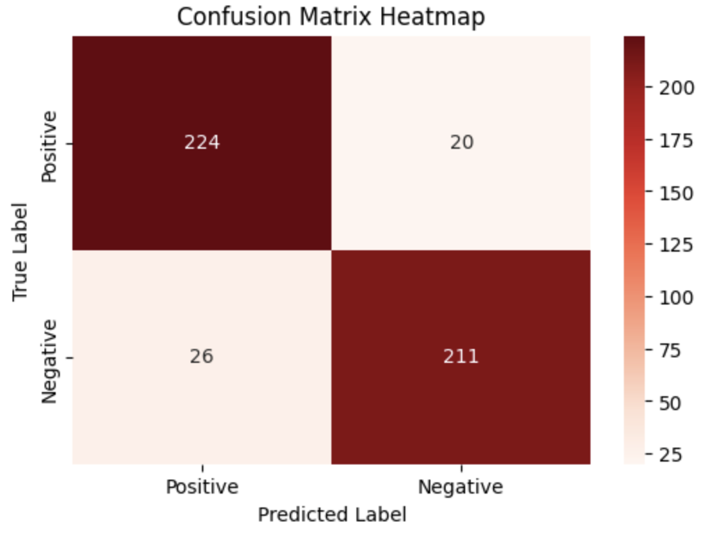
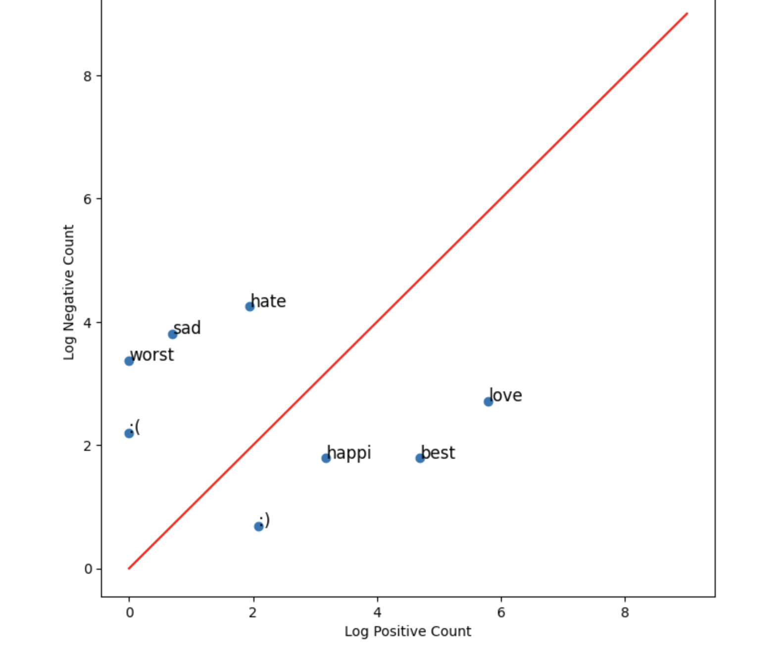

# 💬 Comment Sentiment Analysis

Classifying positive and negative sentiments of YouTube Shorts comments via a Logistic Regression Cross-Validation model.

---

## Overview

Last month, I participated in Kode with Klossy's Machine Learning & AI Camp, where two weeks were spent learning more about sentiment analysis, semantic searching, and how API-interfaces make projects like chatbots come to life. This was the first of two works that I created using my new skills utilizing a KWK-specific dataset with comments from YouTube Shorts; it contained 2,402 comments about different animal videos, each with an assigned sentiment of positive or negative. The primary goal of this project was to explore processing and extracting text features, as well as using Logistic Regression to determine binary correlation. The model learns to determine the sentiment of each comment through a combination of reviewing the frequency dictionary as well as other features. A cell was set aside for GridSearchCV to try and come up with optimal parameters, but the most informative part of the project—its shortcomings—were determined via graphs and reports.

---

## Dataset

- **Source:** [KWK Animal YouTube Shorts Dataset](https://gist.githubusercontent.com/kaitwithkwk/fd23145e34cb12037df4e679407eec5e/raw/1a112c21296c2b4474cd2d0fbf159a4adeb04852/animal_youtube_shorts_safe.csv)
- **Size:** 2,402 comments, 1201 positive and 1201 negative
- **Features:** Bias, frequency sums, ratio, normalized scores, comment length, sentiment density 
- **Target classes:** “Positive comments,” “Negative comments”

---

## Results

The model achieved **90% accuracy** on the test set—minor changes didn’t improve the accuracy, so it can be assumed that the features are the bottleneck of its progress. 

### Confusion Matrix 


### Classification Report

| Class | Precision | Recall | F1-Score | Support |
| --- | --- | --- | --- | --- |
| Positive Comments | 0.90 | 0.92 | 0.91 | 244 |
| Negative Comments | 0.91 | 0.89 | 0.90 | 237 |
| Accuracy | | | 0.90 | 481 |
| Macro Avg | 0.90 | 0.90 | 0.90 | 481 |
| Weighted Avg | 0.90 | 0.90 | 0.90 | 481 |

---

## Key Takeaways

- The original tutorial that we used during the program stuck to LogisticRegression with minimal hyperparameters, but the adjustment to LogisticRegressionCV, choosing new regularization, optimizers, and class weights, and increasing the model's features from 3 to 8 helped to increase the overall accuracy.
   - The increase was only from 89% to 90%, but it demonstrated the overall limitations with the features of the model. Changing to TF-IDF features instead might have yielded more significant results. 
- The primary factor that the model looked at before I added additional features was word frequency; this generally garnered good results, but overlooks the other use of those words, their context, the sentence structure, and other devices that play into how we, as humans, communicate.
   - Labels make it easier for the model to understand, but it isn't possible for the model to grasp a full understanding of our sentiments without wider context. Adding negation, for example, might help in this department.
- Anything that adds tokens to the frequency dictionary ended up hurting the overall accuracy, mainly because the feature extraction function wasn't able to make good use of them. This included testing out including more emojis, even though there were already some listed. In the end, these additions were removed.

<br>

<sub><i> Graphing the words “happi”, “sad”, “love”, “hate”, “best”, and “worst” for their sentiment values </i></sub>

---

## Setup

### Prerequisites

```bash
pip install -r requirements.txt
```

### Running the Notebook

```bash
git clone https://github.com/eliasangelss/sentiment-analysis.git
cd sentiment-analysis
jupyter notebook model.ipynb
```

---

## Project Structure

```
sentiment-analysis/
├── model.ipynb       # Includes analysis, modeling, evaluation, and my notes
├── comments.csv      # Dataset
├── requirements.txt  
└── README.md
```

---

## Model Architecture

```
Input (8 features)
  → Logistic Regression
  → Sigmoid Activation (LR feature)
  → Binary Output (Pos/Neg)
```
- **Train-Test Split:** 1921 train / 481 test
- **Optimizer:** LIBLINEAR
- **Loss:** Logistic loss (LR feature)
- **Regularization:** L2 (Cs = 1)

---

## Tools & Libraries

- Python, Jupyter Notebook
- scikit-learn, NLTK
- pandas, NumPy
- matplotlib

---

## License

MIT
